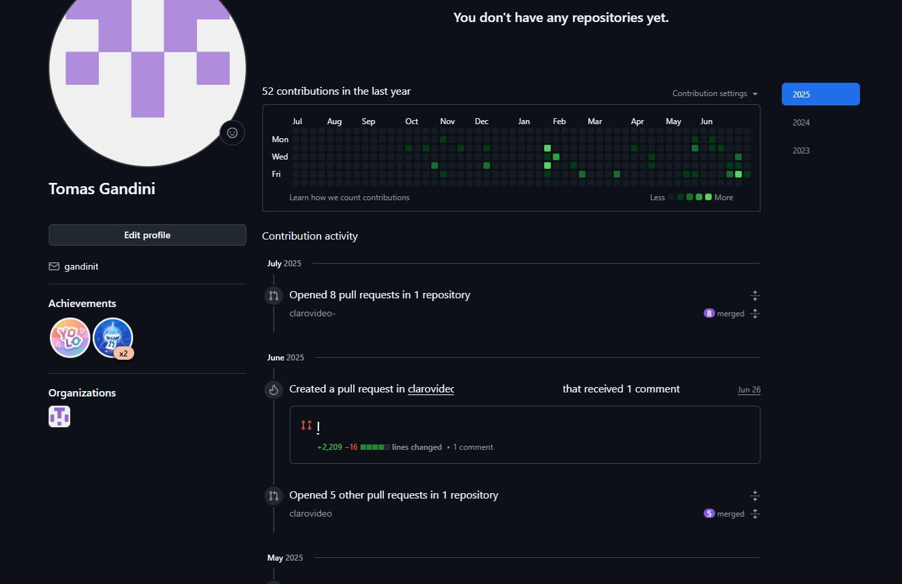

# 💻Hello World!💻

### 👦🏻 About Me:
Hello! My name is Tomás Gandini. I have a Cs Degree from the National University of La Plata and currently work as a backend developer for a streaming platform owned by a major telecommunications company. I have over seven years of experience developing IT solutions to address user problems. I am passionate about learning new technologies and applying my knowledge to help others achieve their goals.

I am a professional committed to quality and excellence in everything I do. I enjoy working in teams and have strong communication and collaboration skills.

I'm interested in learning more about data science, as data collection and processing for decision-making have become critical success factors for achieving organizational goals. I am seeking opportunities to join an IT team in a company where I can grow professionally and contribute my skills.

My tech stack includes:
- Python
- FastAPI
- Elastic Search
- RabbitMQ
- Relational Databases (MySQL, PostgreSQL, SQL Server)
- Non Relational Databases (MongoDB)
- Swagger
- Postman
- Version control tools (Git, TFS, Azure)
- Microservices
- API REST
- ETL

### Professional Contributions (Corporate GitHub)

>Most of my professional work has been done under a corporate GitHub account, which is not publicly accessible due to company policies. Below is a summary of my contributions over the past year:

- **52 commits** to internal projects  
- Over **10 pull requests** reviewed and/or submitted  
- Active involvement in backend development and internal tooling  
- Collaboration following CI/CD workflows and best development practices

### 📷 Here's a snapshot of the contribution graph from my corporate account:

 

I'm happy to provide more context or specific examples of the work I’ve done (within the boundaries of what I can share).

### 🤝🏻 Contact:
📬 Email: gandinitomas@gmail.com 
🖥 LinkedIn: https://www.linkedin.com/in/tomasgandini
